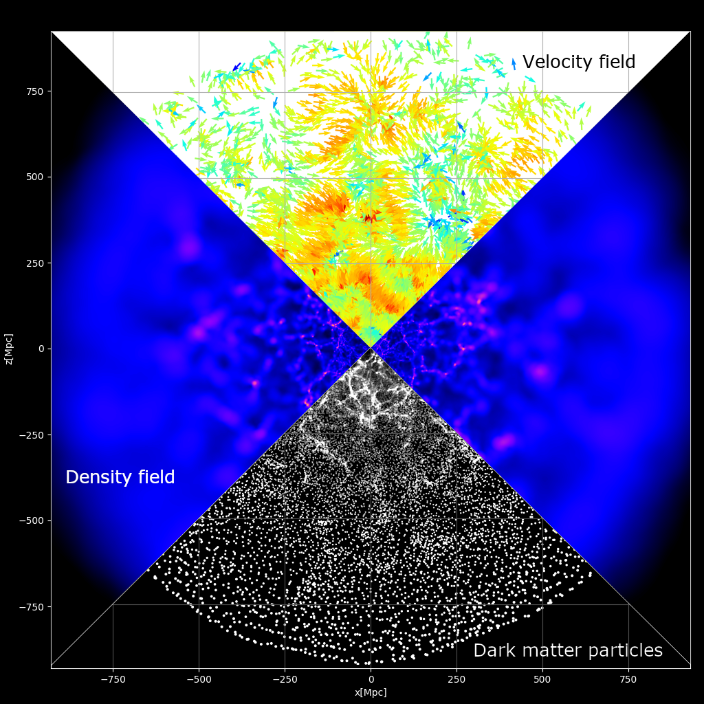

# StePS - STEreographically Projected cosmological Simulations

StePS is a cosmological $N$-body code for compactified, infinite‑domain simulations that removes the limitations of the traditional cubic, triply periodic box. It supports three topologies in a single framework: (i) a fully non‑periodic zoom-in $\mathbb{R}^3$ mode with isotropic open boundaries; (ii) a unique $\mathrm{S}^1\times\mathbb{R}^2$ (“slab”) mode with one periodic axis and open boundaries in transverse directions; and (iii) a standard $\mathrm{T}^3$ fully periodic mode for compatibility and cross‑checks. By avoiding mandatory triple periodicity, StePS eliminates spurious image artefacts and large‑scale force distortions, enabling an infinite‑universe treatment with exceptional dynamic range for a given memory budget—while still allowing conventional $\mathrm{T}^3$ runs when needed.

In $\mathbb{R}^3$, inverse stereographic compactification delivers smoothly decreasing resolution with radius, capturing small‑scale physics near the origin while preserving long‑wavelength modes across the full volume with isotropic outer boundaries. In $\mathrm{S}^1\times\mathbb{R}^2$, the same compactification applied to the transverse plane yields a cylindrical zoom‑in: one axis remains periodic, and the non‑periodic directions have open, isotropic boundaries. This naturally targets systems with axial symmetry (e.g., cosmic filaments and related anisotropic setups, or anisotropic cosmological models) while still sampling rare, massive structures over large effective volumes.

StePS provides a direct $\mathcal{O}(N^2)$ multi-GPU‑accelerated gravity solver for maximal accuracy and a Barnes-Hut octree $\mathcal{O}(N\log N)$ solver for large CPU clusters. This repository also contains scripts for compactified initial conditions, and topology‑aware analysis tools. StePS is the first public code to support both compactified $\mathbb{R}^3$ and slab $\mathrm{S}^1\times\mathbb{R}^2$ cosmological simulations—alongside with the conventional $\mathrm{T}^3$—in one open‑source package.

Example $\mathrm{S}^1\times\mathbb{R}^2$ simulation data: [eltevo.github.io](https://eltevo.github.io/projects/cylindrical-simulations/)

If you plan to publish an academic paper using this software or data, please consider citing the following publications:
- G. Rácz, I. Szapudi, I. Csabai, and L. Dobos "*Compactified Cosmological Simulations of the Infinite Universe*": MNRAS, Volume 477, Issue 2, p.1949-1957 (2018) [astro-ph](https://arxiv.org/abs/1711.04959) [NASA adsabs](https://ui.adsabs.harvard.edu/abs/2018MNRAS.477.1949R/abstract)
- G. Rácz, I. Szapudi, L. Dobos, I. Csabai, and A. S. Szalay "*StePS: A multi-GPU cosmological N-body Code for compactified simulations*": Astron. Comput. 28, 100303 (2019) [astro-ph](https://arxiv.org/abs/1811.05903) [NASA adsabs](https://ui.adsabs.harvard.edu/abs/2019A%26C....2800303R/abstract)
- G. Rácz, V. H. Varga, B. Pál, I. Szapudi, I. Csabai, and T. Sawala "*Cylindrical cosmological simulations with StePS*": In prep. (2026) 

## Visualizations

## Acknowledgement

  *The development of this code has been supported by Department of Physics of Complex Systems, ELTE.*
  *GR would like to thank the Department of Physics & Astronomy, JHU for supporting this work.*
  *GR acknowledges sponsorship of a NASA Postdoctoral Program Fellowship. GR was supported by JPL, which is run under contract by California Institute of Technology for NASA.*
  *GR acknowledges the support of the Research Council of Finland grant 354905*
