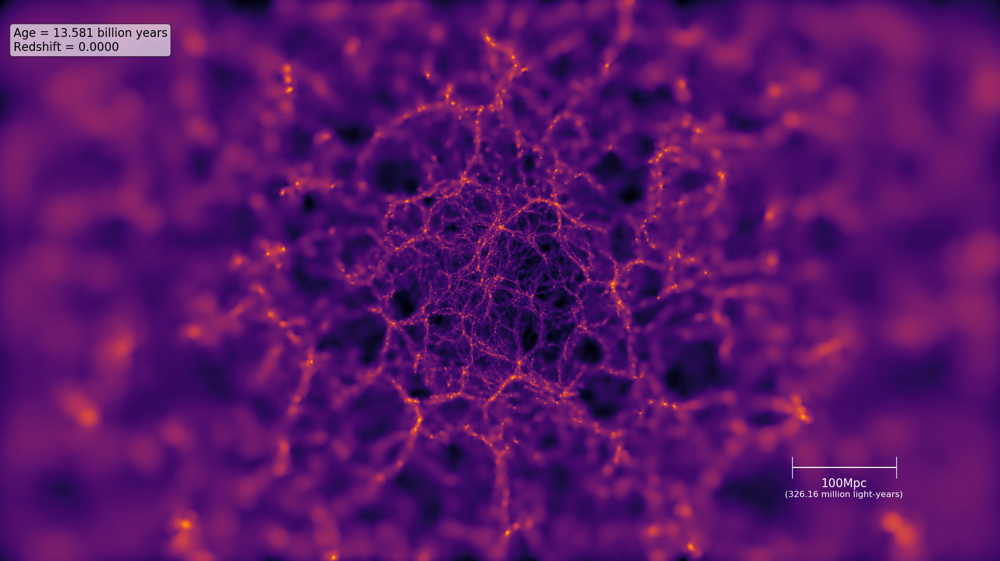
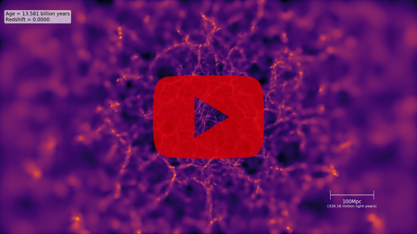
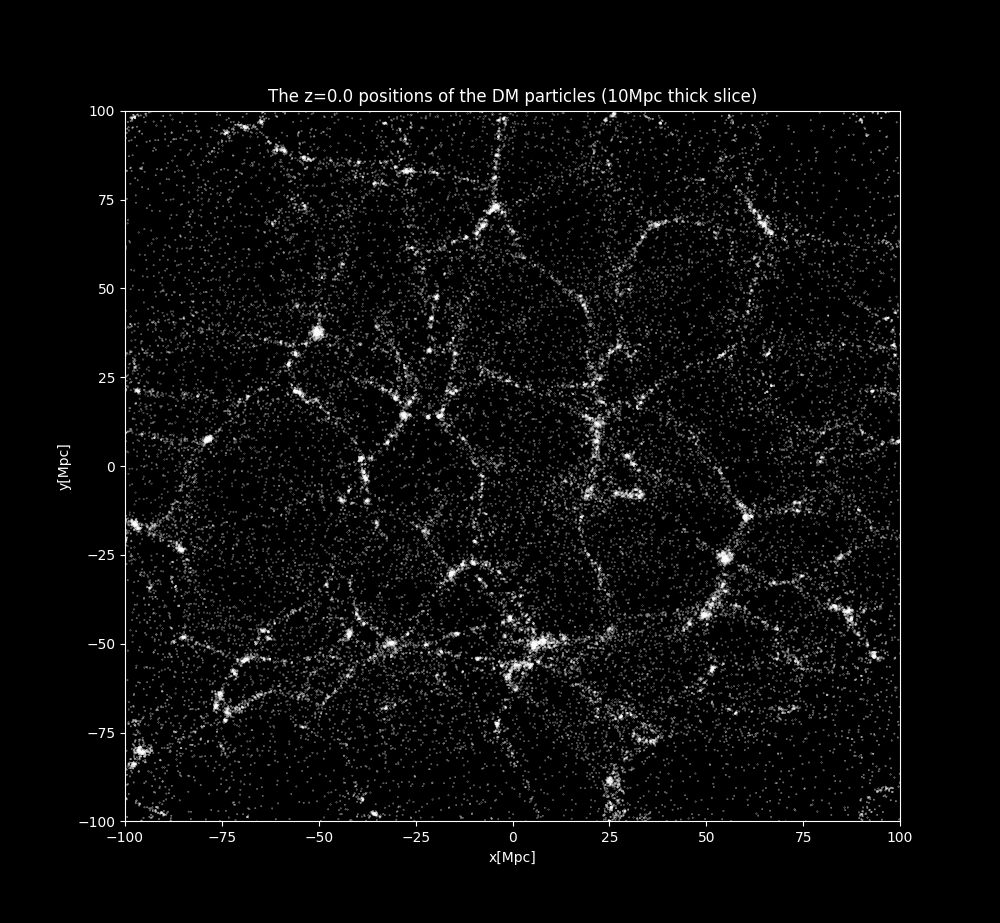
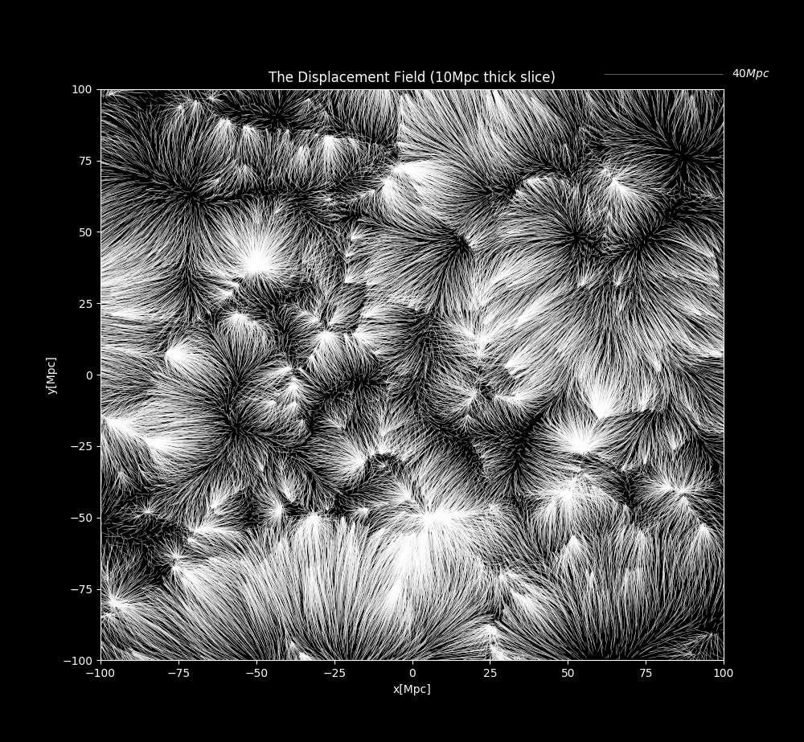

# StePS - STEreographically Projected cosmological Simulations

## An N-body code for non-periodic dark matter cosmological simulations

We present a novel N-body simulation method that compactifies the infinite spatial extent of the Universe into a finite sphere with isotropic boundary conditions to follow the evolution of the large-scale structure. Our approach eliminates the need for periodic boundary conditions, a mere numerical convenience which is not supported by observation and which modifies the law of force on large scales in an unrealistic fashion. With this code, it is possible to simulate an infinite universe with unprecedented dynamic range for a given amount of memory, and in contrast of the traditional periodic simulations, its fundamental geometry and topology match observations.

The StePS code is optimized to run on GPU accelerated HPC systems.

For more information see: [astro-ph](https://arxiv.org/abs/1711.04959) and [astro-ph](https://arxiv.org/abs/1811.05903)

If you plan to publish an academic paper using this software, please consider citing the following publication:

G. Rácz, I. Szapudi, I. Csabai, L. Dobos, "Compactified Cosmological Simulations of the Infinite Universe": MNRAS, Volume 477, Issue 2, p.1949-1957

## Acknowledgement

  *The development of this code has been supported by Department of Physics of Complex Systems, ELTE.*
  *GR would like to thank the Department of Physics & Astronomy, JHU for supporting this work.*
  *GR acknowledges sponsorship of a NASA Postdoctoral Program Fellowship. GR was supported by JPL, which is run under contract by California Institute of Technology for NASA.*
