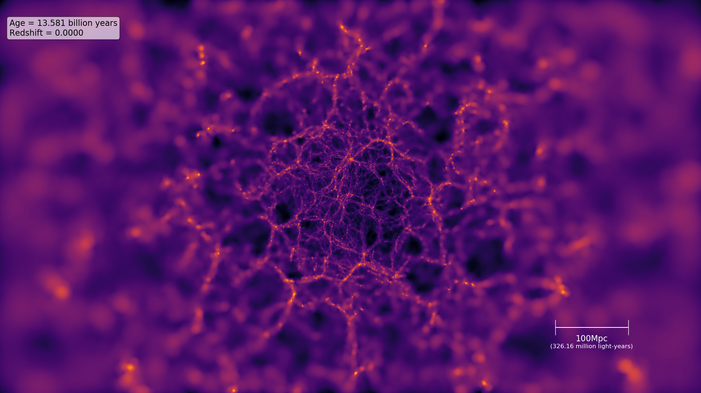
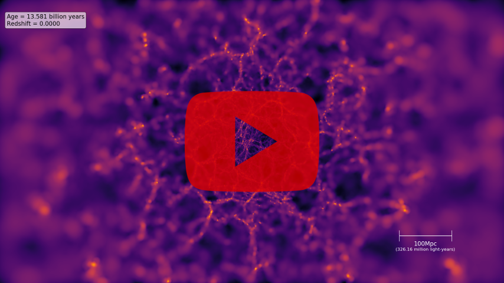
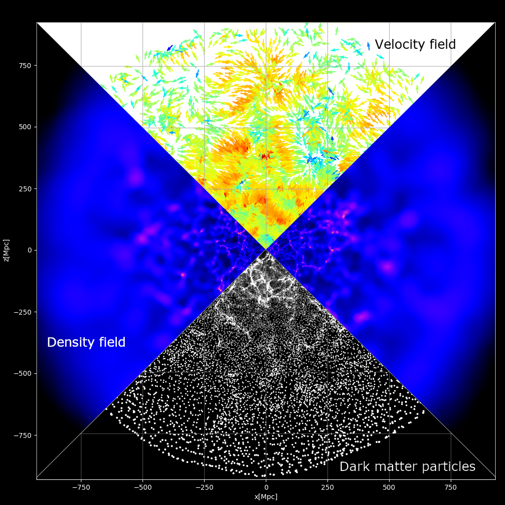
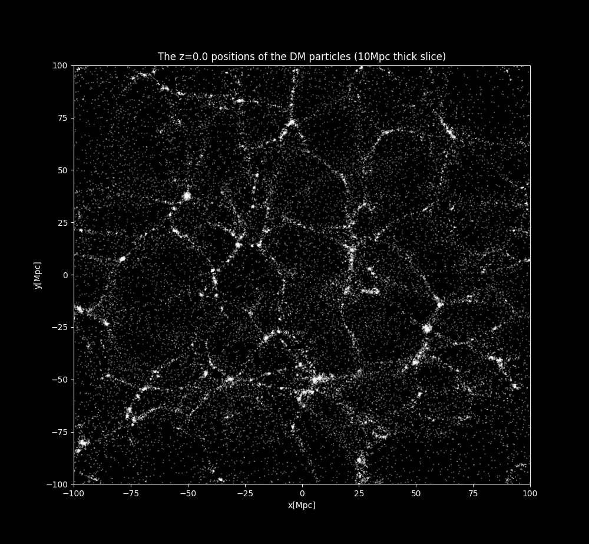
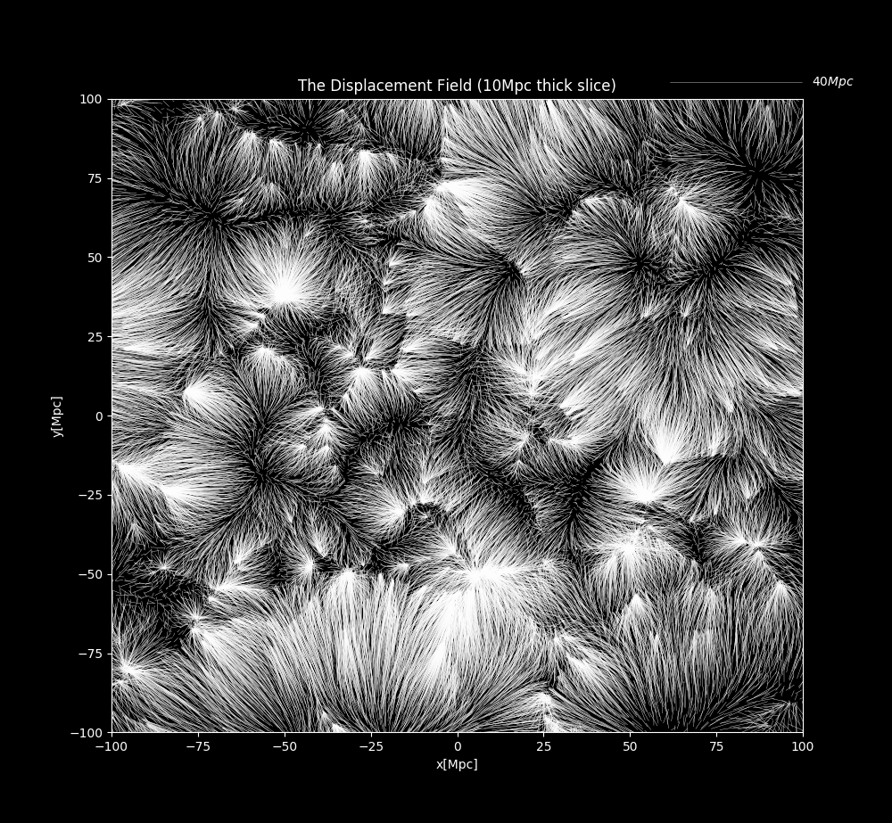

# StePS - STEreographically Projected cosmological Simulations

<p align="center">
  <a href="StePS/CHANGELOG.md"></a>
  <a href="./LICENSE"></a>
  <a href="https://en.cppreference.com/cpp/17"></a>
  <a href="https://docs.nvidia.com/cuda/archive/13.2.0/"></a>
  <br/>
  <a href="https://arxiv.org/abs/1711.04959"></a>
  <a href="https://arxiv.org/abs/1811.05903"></a>
  <a href="https://arxiv.org/abs/2602.20787"></a>
</p>

---

## Overview

StePS is a cosmological $N$-body code for compactified, infinite‑domain simulations that removes the limitations of the traditional cubic, triply periodic box. It supports three topologies in a single framework: (i) a fully non‑periodic zoom-in $\mathbb{R}^3$ mode with isotropic open boundaries; (ii) a unique $\mathrm{S}^1\times\mathbb{R}^2$ (“slab”) mode with one periodic axis and open boundaries in transverse directions; and (iii) a standard $\mathrm{T}^3$ fully periodic mode for compatibility and cross‑checks. By avoiding mandatory triple periodicity, StePS eliminates spurious image artefacts and large‑scale force distortions, enabling an infinite‑universe treatment with exceptional dynamic range for a given memory budget, while still allowing conventional $\mathrm{T}^3$ runs when needed.

In $\mathbb{R}^3$, inverse stereographic compactification delivers smoothly decreasing resolution with radius, capturing small‑scale physics near the origin while preserving long‑wavelength modes across the full volume with isotropic outer boundaries. In $\mathrm{S}^1\times\mathbb{R}^2$, the same compactification applied to the transverse plane yields a cylindrical zoom‑in: one axis remains periodic, and the non‑periodic directions have open, isotropic boundaries. This naturally targets systems with axial symmetry (e.g., cosmic filaments and related anisotropic setups, or anisotropic cosmological models) while still sampling rare, massive structures over large effective volumes.

StePS provides a direct $\mathcal{O}(N^2)$ multi-GPU‑accelerated gravity solver for maximal accuracy and a Barnes-Hut octree $\mathcal{O}(N\log N)$ solver for large CPU clusters. StePS is the first public code to support both zoom-in $\mathbb{R}^3$ and $\mathrm{S}^1\times\mathbb{R}^2$ cosmological simulations&mdash;alongside with the conventional $\mathrm{T}^3$&mdash;in one open‑source package.

Example $\mathrm{S}^1\times\mathbb{R}^2$ simulation data: [eltevo.github.io](https://eltevo.github.io/projects/cylindrical-simulations/)

If you plan to publish an academic paper using this software or data, please consider citing the following publications:
- G. Rácz, I. Szapudi, I. Csabai, and L. Dobos "*Compactified Cosmological Simulations of the Infinite Universe*": MNRAS, Volume 477, Issue 2, p.1949-1957 (2018) [[MNRAS](https://academic.oup.com/mnras/article/477/2/1949/4944906)] [[astro-ph](https://arxiv.org/abs/1711.04959)] [[NASA adsabs](https://ui.adsabs.harvard.edu/abs/2018MNRAS.477.1949R/abstract)]
- G. Rácz, I. Szapudi, L. Dobos, I. Csabai, and A. S. Szalay "*StePS: A multi-GPU cosmological N-body Code for compactified simulations*": Astron. Comput. 28, 100303 (2019) [[Astronomy and Computing](https://www.sciencedirect.com/science/article/pii/S2213133718301938)] [[astro-ph](https://arxiv.org/abs/1811.05903)] [[NASA adsabs](https://ui.adsabs.harvard.edu/abs/2019A%26C....2800303R/abstract)]
- G. Rácz, V. H. Varga, B. Pál, I. Szapudi, I. Csabai, and T. Sawala "*Cylindrical cosmological simulations with StePS*": A&A, 710, A101 (2026) [[A&A](https://www.aanda.org/articles/aa/full_html/2026/06/aa59526-26/aa59526-26.html)] [[astro-ph](https://arxiv.org/abs/2602.20787)]

The initial condition generator for StePS can be find on [github](https://github.com/eltevo/stepsic). Please consider citing the following publication, if you used this initial condition generator:
- B. Pál, G. Rácz, I. Csabai, and I. Szapudi "*stepsic: Initial condition generator for stereographic cosmological simulations*" arXiv pre-print (2026) [[astro-ph](https://arxiv.org/abs/2605.10354)]

## Installation

StePS is written in C++ and parallelised with MPI, OpenMP, and (optionally) CUDA. It runs on GNU/Linux and macOS (Darwin); GPU acceleration is available on GNU/Linux only.

### Dependencies

Required:
- A C++17 compiler (GCC, Intel `icpc`/`icpx`, or Clang)
- An MPI implementation (OpenMPI is recommended; other implementations should work)
- OpenMP (provided by the compilers above)

Optional:
- HDF5 for reading and writing HDF5 snapshots (enabled by default; see [compile-time options](#compile-time-options))
- CUDA Toolkit for multi-GPU force calculation (GNU/Linux only)

### Getting the code

```bash
git clone https://github.com/eltevo/StePS.git
cd StePS/StePS
```

All build commands below are run from the `StePS/StePS` source directory.

### Building with conda (recommended)

The provided conda environment installs a matching compiler toolchain, OpenMPI, and HDF5, so the code builds reproducibly without depending on system libraries. The CUDA Toolkit is **not** provided by conda and must be installed system-wide; the Makefile defaults `CUDA_PATH` to `/usr/local/cuda` (override it with `CUDA_PATH=...`).

```bash
conda env create -f environment.yml
conda activate steps
cp Template-LinuxGCC-Makefile Makefile   # supplies the build rules and compile-time options
./build.sh                               # CPU build using the conda toolchain
```

By default `./build.sh` produces the CPU executable `build/StePS`. Pass `USING_CUDA=YES` for a GPU build (any extra arguments are forwarded to `make`), which produces `build/StePS_CUDA`:

```bash
./build.sh USING_CUDA=YES
```

Edit the [compile-time options](#compile-time-options) in `Makefile` before running `./build.sh` to select the simulation topology and other features.

### Manual build

For CPU-only builds, alternative compilers, or macOS, copy the template matching your platform, set the library paths and compile-time options it contains, then compile:

```bash
cp Template-LinuxGCC-Makefile Makefile    # or Template-LinuxICC-Makefile / Template-Darwin-Makefile
# edit Makefile: set the MPI/HDF5/CUDA paths and the compile-time options
make -j
```

Depending on the `USING_CUDA` setting, this produces `build/StePS` (CPU) or `build/StePS_CUDA` (GPU).

### Compile-time options

Several features are selected at compile time in the `Makefile`. The most important ones are:

| Option | Effect |
| --- | --- |
| `USING_CUDA = YES` | Build the multi-GPU CUDA executable (GNU/Linux only) |
| *(no boundary flag)* | Non-periodic $\mathbb{R}^3$ mode (default) |
| `-DPERIODIC` | Fully periodic $\mathrm{T}^3$ mode |
| `-DPERIODIC_Z` | Cylindrical $\mathrm{S}^1\times\mathbb{R}^2$ mode |
| `-DUSE_BH=0.25` | Barnes-Hut octree solver with the given opening angle (CPU) |
| `-DUSE_SINGLE_PRECISION` | 32-bit force calculation (faster, lower memory) |
| `-DHAVE_HDF5` | Enable HDF5 I/O (on by default) |
| `-DCOSMOPARAM=0` | Background cosmology: 0 = ΛCDM, 1 = wCDM, 2 = CPL, -1 = tabulated |

See [`StePS/README.md`](StePS/README.md) for the full list of options and their interactions.

### Running a simulation

Run the compiled binary under MPI, passing a parameter file. For the GPU build, the final argument is the number of GPUs per MPI task:

```bash
export OMP_NUM_THREADS=1
mpirun -np 1 ./build/StePS_CUDA ./examples/LCDM_SP_1860_com_VOI100.param 1
```

For the CPU build, `OMP_NUM_THREADS` sets the number of threads per MPI task:

```bash
export OMP_NUM_THREADS=8
mpirun -np 1 ./build/StePS ./examples/LCDM_SP_1860_com_VOI100.param
```

Runnable example parameter files and initial conditions are provided in [`StePS/examples/`](StePS/examples/). Full documentation&mdash;including every compile-time option, the parameter-file reference, and the output formats&mdash;is available in [`StePS/README.md`](StePS/README.md).
- G. Rácz, I. Szapudi, I. Csabai, and L. Dobos "*Compactified Cosmological Simulations of the Infinite Universe*": MNRAS, Volume 477, Issue 2, p.1949-1957 (2018) [[MNRAS](https://academic.oup.com/mnras/article/477/2/1949/4944906)] [[astro-ph](https://arxiv.org/abs/1711.04959)] [[NASA adsabs](https://ui.adsabs.harvard.edu/abs/2018MNRAS.477.1949R/abstract)]
- G. Rácz, I. Szapudi, L. Dobos, I. Csabai, and A. S. Szalay "*StePS: A multi-GPU cosmological N-body Code for compactified simulations*": Astron. Comput. 28, 100303 (2019) [[Astronomy and Computing](https://www.sciencedirect.com/science/article/pii/S2213133718301938)] [[astro-ph](https://arxiv.org/abs/1811.05903)] [[NASA adsabs](https://ui.adsabs.harvard.edu/abs/2019A%26C....2800303R/abstract)]
- G. Rácz, V. H. Varga, B. Pál, I. Szapudi, I. Csabai, and T. Sawala "*Cylindrical cosmological simulations with StePS*": In prep. (2026) [[astro-ph](https://arxiv.org/abs/2602.20787)]

## Visualizations




[](https://youtu.be/INuRIqUu0IA "StePS example simulation #1, slice")


[](https://youtu.be/NzGt-pt4TiY "StePS example simulation #1, central high resolution volume")







## Acknowledgement

  *The development of this code has been supported by Department of Physics of Complex Systems, ELTE.*
  *GR would like to thank the Department of Physics & Astronomy, JHU for supporting this work.*
  *GR acknowledges sponsorship of a NASA Postdoctoral Program Fellowship. GR was supported by JPL, which is run under contract by California Institute of Technology for NASA.*
  *GR acknowledges the support of the Research Council of Finland grant 354905*
